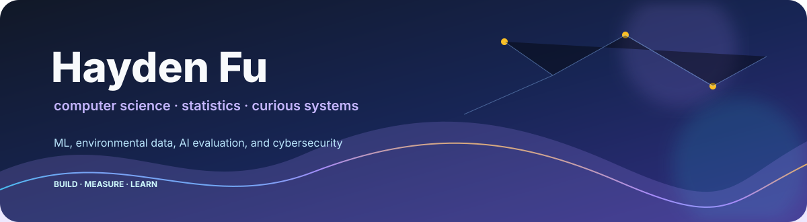

<div align="center">
  <a href="https://haydenmfu.github.io">
    
  </a>
</div>

<p align="center">
  <a href="https://haydenmfu.github.io">website</a>
  ·
  <a href="https://www.linkedin.com/in/hayden-fu">linkedin</a>
  ·
  <a href="mailto:haydenmfu@gmail.com">email</a>
  ·
  looking for <strong>summer 2027</strong> internships
</p>

---

I'm Hayden, a sophomore at Cornell studying computer science and statistics.

Most of my work is research software: estimating irrigation you can only see from satellites, watching how LLM forecasts drift over long horizons, and correcting weather models with local sensors. I like projects where I get to write the pipeline *and* argue about what the results actually mean.

```text
currently  →  Algoverse · Cornell Civil Eng · Cornell Geo Data · CU Cybersecurity
building   →  Python research tooling, assimilation pipelines, forecast eval
competing  →  CTFs (binary, crypto, reverse, networks)
```

## Right now

**[LLM forecast drift](https://github.com/haydenmfu/llm-forecast-drift)** — Algoverse  
How much do language-model forecasts depend on what they said before? I built a Python pipeline that aligns prediction-market prices, order books, and dated news, then evaluated open-weight models across sequential forecasting tasks with linear probes and counterfactual priors. Paper accepted to the Interpreting Agent Behavior workshop at NeurIPS 2026.

**[Irrigation data assimilation](https://github.com/haydenmfu/Irrigation-Estimates)** — Cornell Civil Engineering  
Estimating unobserved irrigation from SMAP soil moisture and land-surface model runs. Particle batch smoother, a lot of careful alignment across time and space, and diagnostics that make the ensemble readable instead of magical.

**Lake-effect snow forecasting** — Cornell Geo Data  
A GAN-based correction model in PyTorch that mixes numerical weather predictions with field sensor series. Also: the unglamorous work of cleaning those sensors until the evaluation means something.

**Cornell Cybersecurity Club**  
CTFs with the competition team — binary exploitation, cryptography, reverse engineering, network security. First place at BSides NYC CTF; also AmateursCTF, OSU CTF, BuckeyeCTF.

## Earlier chapters

<details>
<summary>Older projects that got me here</summary>

<br>

- **I3 cultural resources map** (UIUC, w/ Prof. Asif Wilson) — map app + classification pipeline for 1,000+ cultural/historical resources for Illinois K–12 teachers. ([code](https://github.com/haydenmfu/I3-Initiative))
- **Constitutional AI bias reduction** — prompting strategies to reduce political bias in ChatGPT responses; published in the *Journal of Emerging Investigators*.
- **Encampment-ban policy analysis** (Harvard IQSS) — difference-in-differences on housing/policy data; *Journal of Student Research*.
- **COMPAS bias audit** — demographic performance gaps in a recidivism predictor. ([code](https://github.com/haydenmfu/criminal-justice-bias))

</details>

## Toolkit

`Python` `PyTorch` `pandas` `xarray` `NetCDF` `R` `TypeScript` `Linux` `CTFs`

Geospatial stacks, particle filters, forecast evaluation, and whatever else the next messy dataset demands.

## Say hi

I'm looking for summer 2027 internships in software engineering, data science, or research. If you're working on something adjacent — ML evaluation, environmental data, research tooling, security — [email me](mailto:haydenmfu@gmail.com).

<p align="center">
  <a href="https://haydenmfu.github.io">haydenmfu.github.io</a>
</p>
